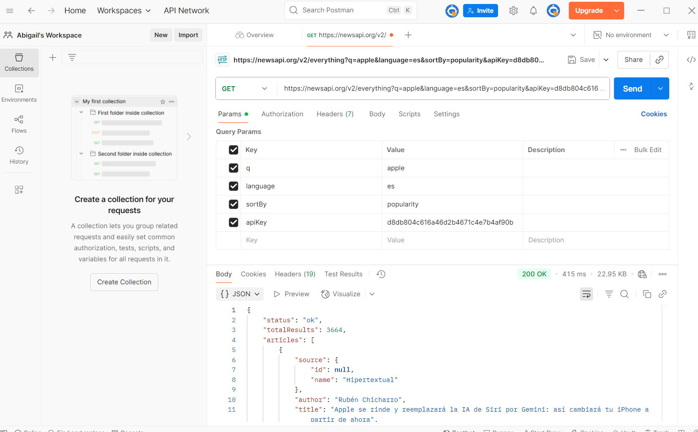
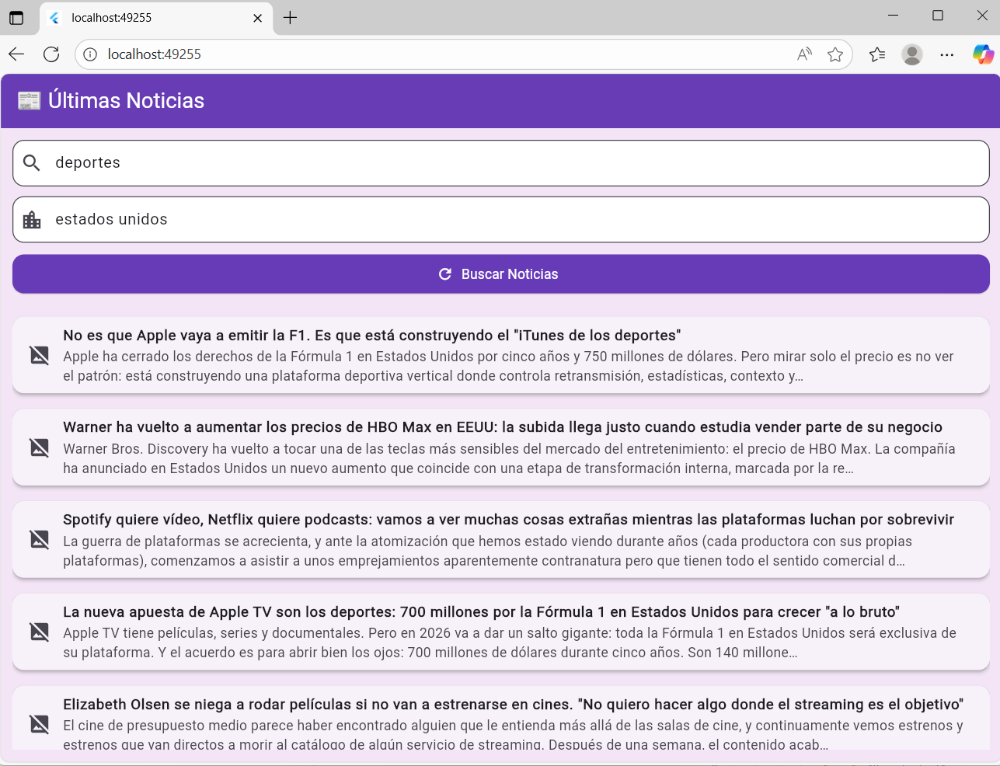

# Práctica — Integración Segura de una API REST (NewsAPI)

## Contexto del proyecto
Aplicación Flutter (Android/iOS/Windows) para consultar noticias desde **NewsAPI**.  
El objetivo es practicar el consumo de una API REST con manejo de secretos, control de errores, caché local y sanitización de texto según las buenas prácticas OWASP.

**Objetivos específicos:**
- Consumir datos mediante HTTPS desde una API REST pública.
- Proteger la API key utilizando un archivo `.env` y el paquete `flutter_dotenv`.
- Implementar control de estados en la UI (cargando, éxito, error, vacío).
- Validar entradas, sanitizar textos y manejar errores de red y de límite de peticiones.
- Mostrar evidencia de integración mediante Postman, emulador y dispositivo físico.

**Fuentes de datos:** API REST de [NewsAPI](https://newsapi.org).  
**Lenguaje:** Dart  
**Framework:** Flutter  
**Manejo de secretos:** `.env`  
**Persistencia temporal:** `shared_preferences`

## Manejo de secretos
El archivo `.env` contiene la clave privada de la API:

## Consumo de la API
Endpoint base: https://newsapi.org/v2/everything

## Parámetros principales
| Parámetro  | Ejemplo      | Descripción            |
| ---------- | ------------ | ---------------------- |
| `q`        | apple        | Tema de búsqueda       |
| `language` | es           | Idioma de resultados   |
| `sortBy`   | popularity   | Orden de noticias      |
| `apiKey`   | (desde .env) | Clave de autenticación |

## Ejemplo de solicitud en Dart:
final uri = Uri.https('newsapi.org', '/v2/everything', {
  'q': 'apple',
  'language': 'es',
  'sortBy': 'popularity',
  'apiKey': dotenv.env['NEWS_API_KEY'],
});

## Estructura del proyecto
<pre>
apinews/
│
├── lib/
│   ├── main.dart              # Punto de entrada; carga .env
│   ├── news_service.dart      # Lógica de negocio, peticiones HTTP y caché
│   └── news_screen.dart       # UI principal (estados: cargando, error, vacío)
│
├── assets/
│   └── evidencias/            # Capturas de Postman y app
│
├── .env                       # Archivo con la API key (ignorado)
├── .gitignore
├── README.md
└── pubspec.yaml
</pre>

## Estados de la aplicación
| Estado          | Descripción                                                     |
| --------------- | --------------------------------------------------------------- |
| **Cargando** | Muestra un indicador mientras se obtiene la respuesta.          |
| **Éxito**     | Lista de noticias con título, descripción e imagen.             |
| **Error**    | Muestra mensaje de error (timeout, HTTP 401/429, sin conexión). |
| **Vacío**    | Muestra “No hay noticias disponibles.”                          |

## Lógica del servicio (news_service.dart)
| Característica               | Descripción                              |
| ---------------------------- | ---------------------------------------- |
| **Timeout de red**           | 8 segundos                               |
| **Reintentos exponenciales** | 1s → 2s → 4s                             |
| **Errores controlados**      | 401 (auth), 429 (rate limit), timeout    |
| **Caché local**              | Uso de `SharedPreferences`               |
| **Sanitización OWASP**       | Limpieza de etiquetas HTML en los textos |
| **Validación**               | Evita consultas vacías o nulas           |

## Prueba en Postman
https://newsapi.org/v2/everything?q=apple&language=es&sortBy=popularity&apiKey=

## Prueba en Emulador
La aplicación fue probada en un **emulador web**.  

